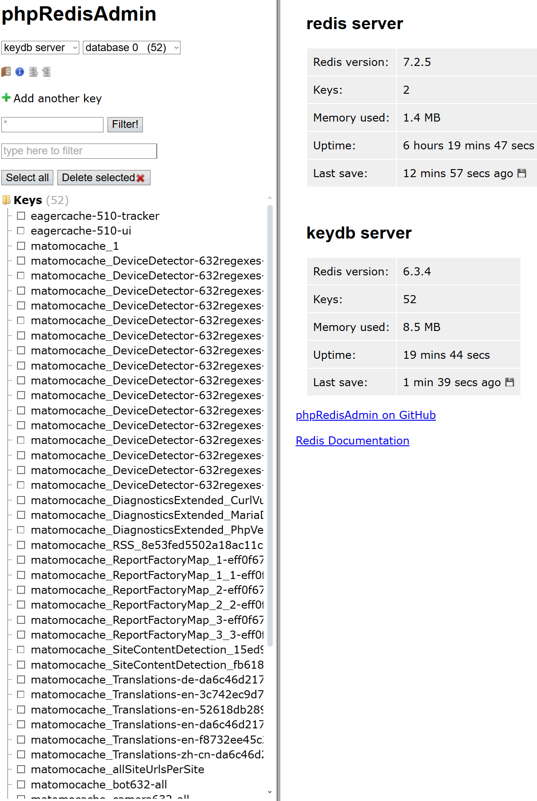

# Centmin Mod Matomo Installation Guide

* [Requirements](#requirements)
* [Web Hosting](#web-hosting)
* [Prepare](#prepare)
* [Letsencrypt Setup](#letsencrypt-setup)
* [Update Nginx](#update-nginx)
* [Create Nginx Vhost Site](#create-nginx-vhost-site)
* [Update Nginx Vhost Site Matomo Rules](#update-nginx-vhost-site-matomo-rules)
* [Install Matomo](#install-matomo)
* [Setup Matomo](#setup-matomo)
* [Setup Matomo Auto-Archiving Cron Task](#setup-matomo-auto-archiving-cron-task)
* [Matomo Optimizations](#matomo-optimizations)
* [Matomo Notes](#matomo-notes)

## Requirements

Matomo and Centmin Mod both have their respective system requirements. For Centmin Mod LEMP stack, recommended would be at least 4GB memory and 4GB swap disk with AlmaLinux or Rocky Linux version 8 or 9 on x86_64 (non-Arm based) servers. 

For Matomo, start with at least 2 to 4 CPU cores and 4-8GB memory with 4GB swap disk and at least 150-200GB of disk space. Read the relevant link for Matomo recommended requirements based on traffic.

* https://matomo.org/faq/on-premise/matomo-requirements/
* https://centminmod.com/install.html

## Web Hosting

For Centmin Mod some recommended and tested web hosts for VPS and dedicated servers include:

* [Hetzner](https://centminmod.com/hetzner/) - below example was installed on Hetzner Cloud dedicated AMD CPU VPS instance - 4x CPU, 16GB memory and 160GB disk storage.
* [Upcloud](https://centminmod.com/upcloud/)
* [Linode](https://centminmod.com/linode/)
* [Vultr](https://centminmod.com/vultr/)
* [DigitalOcean](https://centminmod.com/digitalocean/)
* [Hivelocity](https://centminmod.com/hivelocity/)

Below example install on [Hetzner Cloud](https://centminmod.com/hetzner/) dedicated AMD CPU VPS server running Centmin Mod 140.00beta01 on AlmaLinux 9.4.

```
cat /etc/centminmod-release 
140.00beta01.b085
```
```
cat /etc/os-release 
NAME="AlmaLinux"
VERSION="9.4 (Seafoam Ocelot)"
ID="almalinux"
ID_LIKE="rhel centos fedora"
VERSION_ID="9.4"
PLATFORM_ID="platform:el9"
PRETTY_NAME="AlmaLinux 9.4 (Seafoam Ocelot)"
ANSI_COLOR="0;34"
LOGO="fedora-logo-icon"
CPE_NAME="cpe:/o:almalinux:almalinux:9::baseos"
HOME_URL="https://almalinux.org/"
DOCUMENTATION_URL="https://wiki.almalinux.org/"
BUG_REPORT_URL="https://bugs.almalinux.org/"

ALMALINUX_MANTISBT_PROJECT="AlmaLinux-9"
ALMALINUX_MANTISBT_PROJECT_VERSION="9.4"
REDHAT_SUPPORT_PRODUCT="AlmaLinux"
REDHAT_SUPPORT_PRODUCT_VERSION="9.4"
SUPPORT_END=2032-06-01
```
```
lscpu
Architecture:            x86_64
  CPU op-mode(s):        32-bit, 64-bit
  Address sizes:         40 bits physical, 48 bits virtual
  Byte Order:            Little Endian
CPU(s):                  4
  On-line CPU(s) list:   0-3
Vendor ID:               AuthenticAMD
  BIOS Vendor ID:        QEMU
  Model name:            AMD EPYC-Milan Processor
    BIOS Model name:     NotSpecified
    CPU family:          25
    Model:               1
    Thread(s) per core:  2
    Core(s) per socket:  2
    Socket(s):           1
    Stepping:            1
    BogoMIPS:            4890.80
    Flags:               fpu vme de pse tsc msr pae mce cx8 apic sep mtrr pge mca cmov pat pse36 clflush mmx fxsr sse sse2 ht syscall nx mmxext fxsr_opt pdpe1gb rdt
                         scp lm rep_good nopl cpuid extd_apicid tsc_known_freq pni pclmulqdq ssse3 fma cx16 pcid sse4_1 sse4_2 x2apic movbe popcnt aes xsave avx f16
                         c rdrand hypervisor lahf_lm cmp_legacy cr8_legacy abm sse4a misalignsse 3dnowprefetch osvw topoext perfctr_core ssbd ibrs ibpb stibp vmmcal
                         l fsgsbase bmi1 avx2 smep bmi2 erms invpcid rdseed adx smap clflushopt clwb sha_ni xsaveopt xsavec xgetbv1 xsaves clzero xsaveerptr wbnoinv
                         d arat umip pku ospke rdpid fsrm
Virtualization features: 
  Hypervisor vendor:     KVM
  Virtualization type:   full
Caches (sum of all):     
  L1d:                   64 KiB (2 instances)
  L1i:                   64 KiB (2 instances)
  L2:                    1 MiB (2 instances)
  L3:                    32 MiB (1 instance)
NUMA:                    
  NUMA node(s):          1
  NUMA node0 CPU(s):     0-3
```
```
free -mlt
               total        used        free      shared  buff/cache   available
Mem:           15355        3894        4664         176        7296       11460
Low:           15355       10690        4664
High:              0           0           0
Swap:           4095           0        4095
Total:         19451        3894        8760
```
```
df -hT
Filesystem     Type      Size  Used Avail Use% Mounted on
devtmpfs       devtmpfs  4.0M     0  4.0M   0% /dev
tmpfs          tmpfs     7.5G     0  7.5G   0% /dev/shm
tmpfs          tmpfs     3.0G   94M  3.0G   4% /run
/dev/sda1      ext4      151G   15G  130G  10% /
/dev/sda14     vfat       64M  7.1M   57M  12% /boot/efi
tmpfs          tmpfs     1.5G     0  1.5G   0% /run/user/0
tmpfs          tmpfs     7.5G  588K  7.5G   1% /tmp
```

## Prepare

1. Prepare your intended domain name or subdomain's DNS and Matomo MariaDB MySQL database name, user and password and Maxmind geolocation database license registration. Below guide will use 

* subdomain hostname = `u.domain.com` 
* MariaDB database name = `matomodb`
* MariaDB database username = `matomo_user`
* MariaDB database username password = `matomopass`

a. Update `u.domain.com` DNS A record to point to Centmin Mod server's IPv4 IP address

b. Edit /etc/my.cnf and add `local-infile=1` to `[mysql]` and `[mysqld]` sections and remove existing `local-infile=0`

```
[mysql]
local-infile=1
max_allowed_packet = 64M

[mysqld]
local-infile=1
```

Then restart MariaDB MySQL server via command shortcut or systemctl command

```
mysqlrestart
```

or

```
systemctl restart mariadb
```

c. Create MariaDB database name and user/pass using Centmin Mod's addons/mysqladmin_shell.sh tool

```
/usr/local/src/centminmod/addons/mysqladmin_shell.sh createuserdb matomodb matomo_user matomopass
```

Or if you want a more secure password use included `pwgen` tool to generate. Be sure to write down the output from `echo $newpass`

```
newpass=$(pwgen -1cny 27 | tr -d '\!@#\$%^&*()_+[]{}|;:,.<>?\\`')
echo $newpass
burie1quaiz2OhcauDohwaich

/usr/local/src/centminmod/addons/mysqladmin_shell.sh createuserdb matomodb matomo_user $newpass
```

There is also a Node.js dependency for some Matomo Plugins i.e. Performance Audit Plugin. So install Node.js via Centmin Mod `addons/nodejs.sh` addon installer.

```
/usr/local/src/centminmod/addons/nodejs.sh install
```
```
node --version
v20.16.0

npm --version
10.8.1
```

And YUM dependencies for Performance Audit Plugin. On Centmin Mod LEMP stack with AlmaLinux 9:

List dependencies

```
yum -q list alsa-lib.x86_64 atk.x86_64 cups-libs.x86_64 gtk3.x86_64 ipa-gothic-fonts libXcomposite.x86_64 libXcursor.x86_64 libXdamage.x86_64 libXext.x86_64 libXi.x86_64 libXrandr.x86_64 libXScrnSaver.x86_64 libXtst.x86_64 pango.x86_64 xorg-x11-fonts-100dpi xorg-x11-fonts-75dpi xorg-x11-fonts-cyrillic xorg-x11-fonts-misc xorg-x11-fonts-Type1 xorg-x11-utils | tr -s ' ' | column -t
Installed                       Packages             
alsa-lib.x86_64                 1.2.10-2.el9         @appstream
atk.x86_64                      2.36.0-5.el9         @appstream
cups-libs.x86_64                1:2.3.3op2-27.el9_4  @baseos
gtk3.x86_64                     3.24.31-2.el9        @appstream
libXcomposite.x86_64            0.4.5-7.el9          @appstream
libXcursor.x86_64               1.2.0-7.el9          @appstream
libXdamage.x86_64               1.1.5-7.el9          @appstream
libXext.x86_64                  1.3.4-8.el9          @appstream
libXi.x86_64                    1.7.10-8.el9         @appstream
libXrandr.x86_64                1.5.2-8.el9          @appstream
libXtst.x86_64                  1.2.3-16.el9         @appstream
pango.x86_64                    1.48.7-3.el9         @appstream
Available                       Packages             
libXScrnSaver.x86_64            1.2.3-10.el9         appstream
xorg-x11-fonts-100dpi.noarch    7.5-33.el9           appstream
xorg-x11-fonts-75dpi.noarch     7.5-33.el9           appstream
xorg-x11-fonts-Type1.noarch     7.5-33.el9           appstream
xorg-x11-fonts-cyrillic.noarch  7.5-33.el9           appstream
xorg-x11-fonts-misc.noarch      7.5-33.el9           appstream
xorg-x11-utils.x86_64           7.5-40.el9           appstream
```

Install dependencies

```
yum -y install alsa-lib.x86_64 atk.x86_64 cups-libs.x86_64 gtk3.x86_64 ipa-gothic-fonts libXcomposite.x86_64 libXcursor.x86_64 libXdamage.x86_64 libXext.x86_64 libXi.x86_64 libXrandr.x86_64 libXScrnSaver.x86_64 libXtst.x86_64 pango.x86_64 xorg-x11-fonts-100dpi xorg-x11-fonts-75dpi xorg-x11-fonts-cyrillic xorg-x11-fonts-misc xorg-x11-fonts-Type1 xorg-x11-utils --skip-broken
```

## Letsencrypt Setup

2. Ensure you have Letsencrypt integration and Nginx GeoIP 2 Lite Nginx module support enabled by setting up in Centmin Mod persistent config file `/etc/centminmod/custom_config.inc` the variables for:

```
LETSENCRYPT_DETECT='y'
NGINX_GEOIPTWOLITE='y'
NGXDYNAMIC_GEOIPTWOLITE='y'
```

You can run these 3 commands to automate this:

```
grep 'LETSENCRYPT_DETECT' /etc/centminmod/custom_config.inc || echo "LETSENCRYPT_DETECT='y'" >> /etc/centminmod/custom_config.inc
grep 'NGINX_GEOIPTWOLITE' /etc/centminmod/custom_config.inc || echo "NGINX_GEOIPTWOLITE='y'" >> /etc/centminmod/custom_config.inc
grep 'NGXDYNAMIC_GEOIPTWOLITE' /etc/centminmod/custom_config.inc || echo "NGXDYNAMIC_GEOIPTWOLITE='y'" >> /etc/centminmod/custom_config.inc
```

If you are using Cloudflare for, then also setup Cloudflare DNS API validation as per https://centminmod.com/letsencrypt-freessl.html#dns. Cloudflare API Token variables are set in persistent config file at `/etc/centminmod/custom_config.inc`. This method is recommended if your Centmin Mod Nginx domain is behind Cloudflare orange cloud enabled proxy and you have Cloudflare Full or Full Strict SSL mode enabled.

Cloudflare API Tokens, requires you to create your Cloudflare Token API with permissions for read access to Zone.Zone, and edit/write access to Zone.DNS, across all Zones at https://dash.cloudflare.com/profile/api-tokens and to grab your Cloudflare Account ID from any of your Cloudflare domain's main dashboard's right side column listing.

```
LETSENCRYPT_DETECT='y'
NGINX_GEOIPTWOLITE='y'
NGXDYNAMIC_GEOIPTWOLITE='y'
CF_DNSAPI_GLOBAL='y'
CF_Token="YOUR_CF_TOKEN"
CF_Account_ID="YOUR_CF_ACCOUNT_ID"
```

## Update Nginx

3. Update Nginx to 1.27.0 via centmin.sh menu option 4

```
--------------------------------------------------------
     Centmin Mod Menu 140.00beta01 centminmod.com     
--------------------------------------------------------
1).  Centmin Install
2).  Add Nginx vhost domain
3).  NSD setup domain name DNS
4).  Nginx Upgrade / Downgrade
5).  PHP Upgrade / Downgrade
6).  MySQL User Database Management
7).  Persistent Config File Management
8).  Option Being Revised (TBA)
9).  Option Being Revised (TBA)
10). Memcached Server Re-install
11). MariaDB MySQL Upgrade & Management
12). Zend OpCache Install/Re-install
13). Install/Reinstall Redis PHP Extension
14). SELinux disable
15). Install/Reinstall ImagicK PHP Extension
16). Change SSHD Port Number
17). Multi-thread compression: zstd,pigz,pbzip2,lbzip2
18). Suhosin PHP Extension install
19). Install FFMPEG and FFMPEG PHP Extension
20). NSD Install/Re-Install
21). Data Transfer
22). Add Wordpress Nginx vhost + Cache Plugin
23). Update Centmin Mod Code Base
24). Exit
--------------------------------------------------------
Enter option [ 1 - 24 ] 4
--------------------------------------------------------
```
```
Nginx Upgrade - Would you like to continue? [y/n] y

Current Nginx Version: 1.27.0 (260724-025453-almalinux8-kvm-561a713-br-a71f931)

Install which version of Nginx? (version i.e. type 1.27.0): 1.27.0

Do you still want to continue? [y/n] y
```

On Centmin Mod Nginx upgrade completion, you can verify if Nginx was build with GeoIP 2 Lite nginx module support using below command when installed woult return the value of `ngx_http_geoip2_module`

```
nginx -V 2>&1 | grep -o 'ngx_http_geoip2_module'
ngx_http_geoip2_module
```

```
nginx -V
nginx version: nginx/1.27.0 (040824-141522-almalinux8-kvm-da33abe-br-a71f931)
built by gcc 13.2.1 20231205 (Red Hat 13.2.1-6) (GCC) 
built with OpenSSL 1.1.1k  FIPS 25 Mar 2021
TLS SNI support enabled
```
> configure arguments: --with-ld-opt='-Wl,-E -L/usr/local/zlib-cf/lib -L/usr/local/nginx-dep/lib -ljemalloc -Wl,-z,relro,-z,now -Wl,-rpath,/usr/local/zlib-cf/lib:/usr/local/nginx-dep/lib -pie -flto=2 -flto-compression-level=1 -fuse-ld=gold' --with-cc-opt='-I/usr/local/zlib-cf/include -I/usr/local/nginx-dep/include -m64 -march=native -fPIC -g -O3 -fstack-protector-strong -flto=2 -flto-compression-level=1 -fuse-ld=gold --param=ssp-buffer-size=4 -Wformat -Wno-pointer-sign -Wimplicit-fallthrough=0 -Wno-cast-align -Wno-implicit-function-declaration -Wno-builtin-declaration-mismatch -Wno-deprecated-declarations -Wno-int-conversion -Wno-unused-result -Wno-vla-parameter -Wno-maybe-uninitialized -Wno-return-local-addr -Wno-array-parameter -Wno-alloc-size-larger-than -Wno-address -Wno-array-bounds -Wno-discarded-qualifiers -Wno-stringop-overread -Wno-stringop-truncation -Wno-missing-field-initializers -Wno-unused-variable -Wno-format -Wno-error=unused-result -Wno-missing-profile -Wno-stringop-overflow -Wno-free-nonheap-object -Wno-discarded-qualifiers -Wno-bad-function-cast -Wno-dangling-pointer -Wno-array-parameter -fcode-hoisting -Wno-cast-function-type -Wno-format-extra-args -Wp,-D_FORTIFY_SOURCE=2' --prefix=/usr/local/nginx --sbin-path=/usr/local/sbin/nginx --conf-path=/usr/local/nginx/conf/nginx.conf --build=040824-141522-almalinux8-kvm-da33abe-br-a71f931 --with-compat --without-pcre2 --with-http_stub_status_module --with-http_secure_link_module --with-libatomic --with-http_gzip_static_module --add-dynamic-module=../ngx_brotli --add-module=../zstd-nginx-module --add-dynamic-module=../ngx_http_geoip2_module --with-http_sub_module --with-http_addition_module --with-http_image_filter_module=dynamic --with-http_geoip_module --with-stream_geoip_module --with-stream_realip_module --with-stream_ssl_preread_module --with-threads --with-stream --with-stream_ssl_module --with-http_realip_module --add-dynamic-module=../ngx-fancyindex-0.4.2 --add-module=../ngx_cache_purge-2.5.3 --add-dynamic-module=../ngx_devel_kit-0.3.2 --add-dynamic-module=../set-misc-nginx-module-0.33 --add-dynamic-module=../echo-nginx-module-0.63 --add-module=../redis2-nginx-module-0.15 --add-module=../ngx_http_redis-0.4.0-cmm --add-module=../memc-nginx-module-0.20 --add-module=../srcache-nginx-module-0.33 --add-dynamic-module=../headers-more-nginx-module-0.37 --with-pcre-jit --with-zlib=../zlib-cloudflare-1.3.3 --with-zlib-opt=-fPIC --with-http_ssl_module --with-http_v2_module

## Create Nginx Vhost Site

4. Create Centmin Mod Nginx Vhost with HTTPS Letsencrypt SSL certificate support using Centmin Mod `nv` command line tool (you can also use centmin.sh menu option 2 shell menu for interactive creation) as outlined at https://centminmod.com/nginx_domain_dns_setup.html:

`nv` command options

```
nv

Usage: /bin/nv [-d yourdomain.com] [-s y|n|yd|le|led|lelive|lelived] [-u ftpusername]

  -d  yourdomain.com or subdomain.yourdomain.com
  -s  ssl self-signed create = y or n or https only vhost = yd
  -s  le - letsencrypt test cert or led test cert with https default
  -s  lelive - letsencrypt live cert or lelived live cert with https default
  -u  your FTP username

  example:

  /bin/nv -d yourdomain.com -s y -u ftpusername
  /bin/nv -d yourdomain.com -s n -u ftpusername
  /bin/nv -d yourdomain.com -s yd -u ftpusername
  /bin/nv -d yourdomain.com -s le -u ftpusername
  /bin/nv -d yourdomain.com -s led -u ftpusername
  /bin/nv -d yourdomain.com -s lelive -u ftpusername
  /bin/nv -d yourdomain.com -s lelived -u ftpusername
```

For Centmin Mod Nginx vhost with Letsencrypt HTTPS default changing `ftpusername` to your desired pure-ftpd virtual FTP username. The password will be auto generated and displayed when creation run is completed.

```
nv -d u.domain.com -s lelived -u ftpusername
```

You'll get information for your Nginx vhost like including the pure-ftpd virtual FTP user credentials https://centminmod.com/ftp.html:

```
-------------------------------------------------------------
FTP hostname : xxx.xxx.xxx.xxx
FTP port : 21
FTP mode : FTP (explicit SSL)
FTP Passive (PASV) : ensure is checked/enabled
FTP username created for u.domain.com : ftpusername
FTP password created for u.domain.com : O2DxxxxxxJRHWKy
-------------------------------------------------------------
vhost for u.domain.com created successfully

AUDITD_ENABLE is set to = n

domain: http://u.domain.com
vhost conf file for u.domain.com created: /usr/local/nginx/conf/conf.d/u.domain.com.conf

vhost ssl for u.domain.com created successfully

domain: https://u.domain.com
vhost ssl conf file for u.domain.com created: /usr/local/nginx/conf/conf.d/u.domain.com.ssl.conf

upload files to /home/nginx/domains/u.domain.com/public
vhost log files directory is /home/nginx/domains/u.domain.com/log
```

And also shows log location if you need to revisit the credential info or troubleshoot Nginx vhost creation

```
-------------------------------------------------------------
vhost for u.domain.com setup successfully
u.domain.com setup info log saved at: 
/root/centminlogs/centminmod_040824-143037_nginx_addvhost_nv.log
-------------------------------------------------------------
```

`nv` command and centmin.sh menu option 2 or 22 will also save a `*-remove-*.log` like `centminmod_040824-143037_nginx_addvhost_nv-remove-cmds-u.domain.com.log` with commands to remove the created Nginx vhost

```
ls -lAhrt /root/centminlogs/ | tail -2
-rw-r--r-- 1 root root 1.4K Aug  4 14:30 centminmod_040824-143037_nginx_addvhost_nv-remove-cmds-u.domain.com.log
-rw-r--r-- 1 root root 8.5K Aug  4 14:30 centminmod_040824-143037_nginx_addvhost_nv.log
```

You can optionally setup some SSH command aliases commands for easier navigation of your Nginx vhost. Type in SSH session:

```
alias myconf='nano /usr/local/nginx/conf/conf.d/u.domain.com.ssl.conf'
alias mylog='pushd /home/nginx/domains/u.domain.com/log/'
alias mypub='pushd /home/nginx/domains/u.domain.com/public/'
```

and add these 3 lines into your `/root/.bashrc` file.

Then you'll be able to type:

* `myconf` to launch nano text editor to edit Nginx vhost config file
* `mylog` to change into Nginx vhost's log directory using pushd command
* `mypub` to change into Nginx vhost's public web root directory

## Update Nginx Vhost Site Matomo Rules

5. Update Centmin Mod Nginx vhost config file `/usr/local/nginx/conf/conf.d/u.domain.com.ssl.conf` for Matomo nginx rules

Edit your Nginx vhost config file at `/usr/local/nginx/conf/conf.d/u.domain.com.ssl.conf` replacing the default `location / {}` context content

```
  location / {
  include /usr/local/nginx/conf/503include-only.conf;

# block common exploits, sql injections etc
#include /usr/local/nginx/conf/block.conf;

  # Enables directory listings when index file not found
  #autoindex  on;

  # Shows file listing times as local time
  #autoindex_localtime on;

  # Wordpress Permalinks example
  #try_files $uri $uri/ /index.php?q=$uri&$args;

  }
```

with the below content - keeping `/usr/local/nginx/conf/503include-only.conf` include file to support [Centmin Mod's 503 sitestatus maintenance HTML mode](https://community.centminmod.com/threads/sitestatus-maintenance-mode.5599/). These Matomo Nginx rules are a modification of Matomo's Nginx rules https://github.com/matomo-org/matomo-nginx/blob/master/sites-available/matomo.conf made for Centmin Mod Nginx.

```
# Matomo Stuff
  # https://github.com/matomo-org/matomo-nginx/blob/master/sites-available/matomo.conf
  add_header Referrer-Policy origin always; # make sure outgoing links don't show the URL to the Matomo instance

  ## only allow accessing the following php files
  location ~ ^/(index|matomo|piwik|js/index|plugins/HeatmapSessionRecording/configs)\.php$ {
    include /usr/local/nginx/conf/php.conf; # we have to include this again here inside of this location block
    try_files $fastcgi_script_name =404; # protects against CVE-2019-11043. If this line is already included in your snippets/fastcgi-php.conf you can comment it here.
    fastcgi_param HTTP_PROXY ""; # prohibit httpoxy: https://httpoxy.org/
  }

  # LOCATION DIRECTIVES
  location / {
    include /usr/local/nginx/conf/503include-only.conf;
    try_files $uri $uri/ =404;

    # Matomo $_SERVER variables
    fastcgi_param MM_COUNTRY_CODE $geoip2_data_country_code;
    fastcgi_param MM_CONTINENT_NAME $geoip2_data_continent_name;
    fastcgi_param MM_COUNTRY_CODE $geoip2_data_country_code;
    fastcgi_param MM_COUNTRY_NAME $geoip2_data_country_name;
    fastcgi_param MM_REGION_CODE $geoip2_data_region_iso;
    fastcgi_param MM_REGION_NAME $geoip2_data_region_name;
    fastcgi_param MM_LATITUDE $geoip2_data_location_latitude;
    fastcgi_param MM_LONGITUDE $geoip2_data_location_longitude;
    fastcgi_param MM_POSTAL_CODE $geoip2_data_postal_code;
    fastcgi_param MM_CITY_NAME $geoip2_data_city_name;
    fastcgi_param MM_ISP $geoip2_data_autonomous_system_organization;
    fastcgi_param MM_ORG $geoip2_data_autonomous_system_number;
  }

  ## disable all access to the following directories
  location ~ ^/(config|tmp|core|lang) {
    deny all;
    return 403; # replace with 404 to not show these directories exist
  }

  location ~ /\.ht {
    deny  all;
    return 403;
  }

  location ~ js/container_.*_preview\.js$ {
    expires off;
    add_header Cache-Control 'private, no-cache, no-store';
  }

  location ~ ^/(libs|vendor|misc|node_modules) {
    deny all;
    return 403;
  }

  location ~ \.(gif|ico|jpg|png|svg|js|css|htm|html|mp3|mp4|wav|ogg|avi|ttf|eot|woff|woff2)$ {
    allow all;
    ## Cache images,CSS,JS and webfonts for an hour
    ## Increasing the duration may improve the load-time, but may cause old files to show after an Matomo upgrade
    expires 1h;
    add_header Pragma public;
    add_header Cache-Control "public";
  }
```

The difference between Centmin Mod's Matomo Nginx rules and Matomo's defaults is removal of the PHP location context match for

```
    ## deny access to all other .php files
    location ~* ^.+\.php$ {
        deny all;
        return 403;
    }
```

Centmin Mod LEMP stack Nginx vhost's do not need the PHP location context match as it includes with each created Nginx vhost and include file `/usr/local/nginx/conf/php.conf` that you can use in it's place.

```
  include /usr/local/nginx/conf/php.conf;
```

Optionally, you can [enable Centmin Mod Nginx JSON formatted access logs](https://community.centminmod.com/threads/how-to-configure-nginx-for-json-based-access-logging.19641/) for easier parsing of access logs by uncommenting the additional `access_log` line in `/usr/local/nginx/conf/conf.d/u.domain.com.ssl.conf`.

Change from

```
  access_log /home/nginx/domains/u.domain.com/log/access.log combined buffer=256k flush=5m;
  #access_log /home/nginx/domains/u.domain.com/log/access.json main_json buffer=256k flush=5m;
  error_log /home/nginx/domains/u.domain.com/log/error.log;
```

to

```
  access_log /home/nginx/domains/u.domain.com/log/access.log combined buffer=256k flush=5m;
  access_log /home/nginx/domains/u.domain.com/log/access.json main_json buffer=256k flush=5m;
  error_log /home/nginx/domains/u.domain.com/log/error.log;
```

If using Cloudflare, uncomment and enable `/usr/local/nginx/conf/cloudflare.conf` include file in `/usr/local/nginx/conf/conf.d/u.domain.com.ssl.conf`. This ensures Centmin Mod Nginx logs the real visitor IP address.

Change from

```
  # uncomment cloudflare.conf include if using cloudflare for
  # server and/or vhost site
  #include /usr/local/nginx/conf/cloudflare.conf;
```

to

```
  # uncomment cloudflare.conf include if using cloudflare for
  # server and/or vhost site
  include /usr/local/nginx/conf/cloudflare.conf;
```

Comment out `/usr/local/nginx/conf/staticfiles.conf` and `/usr/local/nginx/conf/drop.conf` include files in `/usr/local/nginx/conf/conf.d/u.domain.com.ssl.conf`

```
  #include /usr/local/nginx/conf/staticfiles.conf;
  #include /usr/local/nginx/conf/drop.conf;
```
and also comment out Centmin Mod Nginx autoprotect include file `/usr/local/nginx/conf/autoprotect/u.domain.com/autoprotect-u.domain.com.conf`

```
  #include /usr/local/nginx/conf/autoprotect/u.domain.com/autoprotect-u.domain.com.conf;
```

Example for the full Centmin Mod Nginx vhost for Matomo created site behind Cloudflare orange cloud proxy with Cloudflare Flexible SSL ([note for Cloudflare Full/Full Strict SSL modes](#cloudflare-full-ssl)) at `/usr/local/nginx/conf/conf.d/u.domain.com.ssl.conf`:

```
#x# HTTPS-DEFAULT
 server {
   listen   80;
   #x#   listen   [::]:80;
   server_name u.domain.com.com www.u.domain.com.com;
   return 302 https://u.domain.com.com$request_uri;
   root /home/nginx/domains/u.domain.com.com/public;
   include /usr/local/nginx/conf/staticfiles.conf;
 }


server {
  listen 443 ssl;
  listen   [::]:443 ssl;
  http2 on;
  server_name u.domain.com.com www.u.domain.com.com;

  include /usr/local/nginx/conf/ssl/u.domain.com.com/u.domain.com.com.crt.key.conf;
  include /usr/local/nginx/conf/ssl_include.conf;

  # cloudflare authenticated origin pull cert community.centminmod.com/threads/13847/
  #ssl_client_certificate /usr/local/nginx/conf/ssl/cloudflare/u.domain.com.com/origin.crt;
  #ssl_verify_client on;
    
  # mozilla recommended
  ssl_ciphers ECDHE-ECDSA-AES128-GCM-SHA256:ECDHE-RSA-AES128-GCM-SHA256:ECDHE-ECDSA-AES256-GCM-SHA384:ECDHE-RSA-AES256-GCM-SHA384:ECDHE-ECDSA-CHACHA20-POLY1305:ECDHE-RSA-CHACHA20-POLY1305:DHE-RSA-AES128-GCM-SHA256:DHE-RSA-AES256-GCM-SHA384;
  ssl_prefer_server_ciphers   on;
  #add_header Alternate-Protocol  443:npn-spdy/3;

  # before enabling HSTS line below read centminmod.com/nginx_domain_dns_setup.html#hsts
  #add_header Strict-Transport-Security "max-age=31536000; includeSubdomains;";
  #add_header X-Frame-Options SAMEORIGIN;
  add_header X-Xss-Protection "1; mode=block" always;
  add_header X-Content-Type-Options "nosniff" always;
  #add_header Referrer-Policy "strict-origin-when-cross-origin";
  #add_header Permissions-Policy "accelerometer=(), camera=(), geolocation=(), gyroscope=(), magnetometer=(), microphone=(), payment=(), usb=()";
  #spdy_headers_comp 5;
  ssl_buffer_size 1369;
  ssl_session_tickets on;
  
  # enable ocsp stapling
  resolver 8.8.8.8 8.8.4.4 1.1.1.1 1.0.0.1 valid=10m;
  resolver_timeout 10s;
  ssl_stapling on;
  ssl_stapling_verify on;

# ngx_pagespeed & ngx_pagespeed handler
#include /usr/local/nginx/conf/pagespeed.conf;
#include /usr/local/nginx/conf/pagespeedhandler.conf;
#include /usr/local/nginx/conf/pagespeedstatslog.conf;

  # limit_conn limit_per_ip 16;
  # ssi  on;

  access_log /home/nginx/domains/u.domain.com.com/log/access.log combined buffer=256k flush=5m;
  access_log /home/nginx/domains/u.domain.com.com/log/access.json main_json buffer=256k flush=5m;
  error_log /home/nginx/domains/u.domain.com.com/log/error.log;

  #include /usr/local/nginx/conf/autoprotect/u.domain.com.com/autoprotect-u.domain.com.com.conf;
  root /home/nginx/domains/u.domain.com.com/public;
  # uncomment cloudflare.conf include if using cloudflare for
  # server and/or vhost site
  include /usr/local/nginx/conf/cloudflare.conf;
  include /usr/local/nginx/conf/503include-main.conf;

  # Matomo Stuff
  # https://github.com/matomo-org/matomo-nginx/blob/master/sites-available/matomo.conf
  add_header Referrer-Policy origin always; # make sure outgoing links don't show the URL to the Matomo instance

  ## only allow accessing the following php files
  location ~ ^/(index|matomo|piwik|js/index|plugins/HeatmapSessionRecording/configs)\.php$ {
    include /usr/local/nginx/conf/php.conf; # we have to include this again here inside of this location block
    try_files $fastcgi_script_name =404; # protects against CVE-2019-11043. If this line is already included in your snippets/fastcgi-php.conf you can comment it here.
    fastcgi_param HTTP_PROXY ""; # prohibit httpoxy: https://httpoxy.org/
  }

  # LOCATION DIRECTIVES
  location / {
    include /usr/local/nginx/conf/503include-only.conf;
    try_files $uri $uri/ =404;

    # Matomo $_SERVER variables
    fastcgi_param MM_COUNTRY_CODE $geoip2_data_country_code;
    fastcgi_param MM_CONTINENT_NAME $geoip2_data_continent_name;
    fastcgi_param MM_COUNTRY_CODE $geoip2_data_country_code;
    fastcgi_param MM_COUNTRY_NAME $geoip2_data_country_name;
    fastcgi_param MM_REGION_CODE $geoip2_data_region_iso;
    fastcgi_param MM_REGION_NAME $geoip2_data_region_name;
    fastcgi_param MM_LATITUDE $geoip2_data_location_latitude;
    fastcgi_param MM_LONGITUDE $geoip2_data_location_longitude;
    fastcgi_param MM_POSTAL_CODE $geoip2_data_postal_code;
    fastcgi_param MM_CITY_NAME $geoip2_data_city_name;
    fastcgi_param MM_ISP $geoip2_data_autonomous_system_organization;
    fastcgi_param MM_ORG $geoip2_data_autonomous_system_number;
  }

  ## disable all access to the following directories
  location ~ ^/(config|tmp|core|lang) {
    deny all;
    return 403; # replace with 404 to not show these directories exist
  }

  location ~ /\.ht {
    deny  all;
    return 403;
  }

  location ~ js/container_.*_preview\.js$ {
    expires off;
    add_header Cache-Control 'private, no-cache, no-store';
  }

  location ~ ^/(libs|vendor|misc|node_modules) {
    deny all;
    return 403;
  }

  location ~ \.(gif|ico|jpg|png|svg|js|css|htm|html|mp3|mp4|wav|ogg|avi|ttf|eot|woff|woff2)$ {
    allow all;
    ## Cache images,CSS,JS and webfonts for an hour
    ## Increasing the duration may improve the load-time, but may cause old files to show after an Matomo upgrade
    expires 1h;
    add_header Pragma public;
    add_header Cache-Control "public";
  }

  include /usr/local/nginx/conf/php.conf;
  
  include /usr/local/nginx/conf/pre-staticfiles-local-u.domain.com.com.conf;
  include /usr/local/nginx/conf/pre-staticfiles-global.conf;
  #include /usr/local/nginx/conf/staticfiles.conf;
  #include /usr/local/nginx/conf/drop.conf;
  #include /usr/local/nginx/conf/errorpage.conf;
  include /usr/local/nginx/conf/vts_server.conf;
}
```

### Cloudflare Full SSL

If you run Cloudflare orange cloud enabled proxy in front of Matomo site and have set Cloudflare Full/Full Strict SSL and set Cloudflare to always redirect to HTTPS, you may need to comment out the Centmin Mod Nginx non-HTTPS port 80 to HTTPS port 443 redirect `server{}` context

change in `/usr/local/nginx/conf/conf.d/u.domain.com.ssl.conf` from

```
 server {
   listen   80;
   #x#   listen   [::]:80;
   server_name u.domain.com.com www.u.domain.com.com;
   return 302 https://u.domain.com.com$request_uri;
   root /home/nginx/domains/u.domain.com.com/public;
   include /usr/local/nginx/conf/staticfiles.conf;
 }
```

to

```
# server {
#   listen   80;
#   #x#   listen   [::]:80;
#   server_name u.domain.com.com www.u.domain.com.com;
#   return 302 https://u.domain.com.com$request_uri;
#   root /home/nginx/domains/u.domain.com.com/public;
#   include /usr/local/nginx/conf/staticfiles.conf;
# }
```

Turn off the default `disable_function` for `shell_exec` as Matomo requires the use of it.

```
sed -i 's|^php_admin_value\[disable_functions\]|;php_admin_value\[disable_functions\]|' /usr/local/etc/php-fpm.conf
```

Verify it's disabled with semi-colon in front of the setting:

```
cat /usr/local/etc/php-fpm.conf | grep disable_functions
;php_admin_value[disable_functions] = shell_exec
```

Then restart Nginx using either Centmin Mod command shortcut or systemctl

Restart both Nginx and PHP-FPM for Nginx vhost and PHP-FPM changes to take effect:

```
nprestart
```

or

```
systemctl restart nginx php-fpm
```

For Nginx only restart:

```
ngxrestart
```

or

```
systemctl restart nginx
```

to restart PHP-FPM only:

```
fpmrestart
```

or

```
systemctl restart php-fpm
```

## Install Matomo

6. Install Matomo

Install Matomo as per guide at https://matomo.org/faq/on-premise/installing-matomo/.

The created Nginx vhost's public web root is at `/home/nginx/domains/u.domain.com/public`. I usually like to download files to a staging directory first one level above the public web root and then apply nginx user/group permissions and copy the extracted zip file contents to public web root.

```
mkdir -p /home/nginx/domains/u.domain.com/matomo-downloads
# create matomo-archives directory for cron task archive logs
mkdir -p /home/nginx/domains/u.domain.com/matomo-archives
cd /home/nginx/domains/u.domain.com/matomo-downloads
wget -O /home/nginx/domains/u.domain.com/matomo-downloads/matomo.zip https://builds.matomo.org/matomo.zip
unzip matomo.zip
chown -R nginx:nginx matomo
cd matomo
\cp -af * /home/nginx/domains/u.domain.com/public
```

Listing public web root's contents after Matomo files copied over:

```
ls -lah /home/nginx/domains/u.domain.com/public
total 428K
drwxr-s--- 13 nginx nginx 4.0K Aug  4 14:42 .
drwxr-s---  7 nginx nginx   84 Aug  4 14:39 ..
-rw-r-----  1 nginx nginx 2.0K Aug  4 14:30 401.html
-rw-r-----  1 nginx nginx 2.0K Aug  4 14:30 403.html
-rw-r-----  1 nginx nginx 2.0K Aug  4 14:30 404.html
-rw-r-----  1 nginx nginx 2.0K Aug  4 14:30 500.html
-rw-r-----  1 nginx nginx 2.0K Aug  4 14:30 502.html
-rw-r-----  1 nginx nginx 2.0K Aug  4 14:30 503.html
-rw-r-----  1 nginx nginx 7.6K Aug  4 14:30 503.jpg
-rw-r-----  1 nginx nginx 2.0K Aug  4 14:30 504.html
-rw-r-----  1 nginx nginx 2.0K Aug  4 14:30 50x.html
-rw-r--r--  1 nginx nginx 109K Jun 10 07:48 CHANGELOG.md
drwxr-sr-x  3 nginx nginx   89 Jun 10 07:48 config
-rwxr-xr-x  1 nginx nginx  753 Jun 10 07:48 console
-rw-r--r--  1 nginx nginx  929 Jun 10 07:48 CONTRIBUTING.md
drwxr-sr-x 53 nginx nginx 4.0K Jun 10 07:48 core
-rw-r--r--  1 nginx nginx  555 Jun 10 07:48 DIObject.php
-rw-r-----  1 nginx nginx 6.3K Aug  4 14:30 index.html
-rw-r--r--  1 nginx nginx  716 Jun 10 07:48 index.php
drwxr-sr-x  2 nginx nginx  114 Jun 10 07:48 js
drwxr-sr-x  2 nginx nginx 4.0K Jun 10 07:48 lang
-rw-r--r--  1 nginx nginx  828 Jun 10 07:48 LegacyAutoloader.php
-rw-r--r--  1 nginx nginx 8.9K Jun 10 07:48 LEGALNOTICE
drwxr-sr-x  9 nginx nginx  140 Jun 10 07:48 libs
-rw-r--r--  1 nginx nginx  35K Jun 10 07:48 LICENSE
-rw-r-----  1 nginx nginx 3.3K Aug  4 14:30 maintenance.html
-rw-r--r--  1 nginx nginx  66K Jun 10 07:48 matomo.js
-rw-r--r--  1 nginx nginx  334 Jun 10 07:48 matomo.php
drwxr-sr-x  7 nginx nginx  127 Jun 10 07:48 misc
drwxr-sr-x 14 nginx nginx  235 Jun 10 07:48 node_modules
-rw-r--r--  1 nginx nginx 6.3K Jun 10 07:48 offline-service-worker.js
-rw-r--r--  1 nginx nginx  66K Jun 10 07:48 piwik.js
-rw-r--r--  1 nginx nginx 2.7K Jun 10 07:48 piwik.php
drwxr-sr-x 69 nginx nginx 4.0K Jun 10 07:48 plugins
-rw-r--r--  1 nginx nginx 4.6K Jun 10 07:48 PRIVACY.md
-rw-r--r--  1 nginx nginx 5.9K Jun 10 07:48 README.md
-rw-r--r--  1 nginx nginx  770 Jun 10 07:48 robots.txt
-rw-r--r--  1 nginx nginx 1.9K Jun 10 07:48 SECURITY.md
drwxr-sr-x  2 nginx nginx   23 Jun 10 07:48 tests
drwxr-sr-x  2 nginx nginx    6 Jun 10 07:48 tmp
drwxr-sr-x 22 nginx nginx  321 Jun 10 07:48 vendor
```

## Setup Matomo

7. Setup Matomo

Open your web browser and navigate to the URL to which you uploaded Matomo - `https://u.domain.com`. If everything is uploaded correctly, you should see the Matomo Installation Welcome Screen and proceed as outlined.

The MariaDB MySQL database tables installed:

```
mysql -t -e "SELECT CONCAT(table_schema,'.',table_name) AS 'Table Name', CONCAT(ROUND(table_rows,2),' Rows') AS 'Number of Rows', ENGINE AS 'Storage Engine', CONCAT(ROUND(data_length/(1024*1024),2),'MB') AS 'Data Size', CONCAT(ROUND(index_length/(1024*1024),2),'MB') AS 'Index Size', CONCAT(ROUND((data_length+index_length)/(1024*1024),2),'MB') AS 'Total', ROW_FORMAT, TABLE_COLLATION FROM information_schema.TABLES WHERE table_schema LIKE 'matomodb' ORDER BY table_name;"

+-------------------------------------------------+----------------+----------------+-----------+------------+--------+------------+--------------------+
| Table Name                                      | Number of Rows | Storage Engine | Data Size | Index Size | Total  | ROW_FORMAT | TABLE_COLLATION    |
+-------------------------------------------------+----------------+----------------+-----------+------------+--------+------------+--------------------+
| matomodb.matomo_access                         | 1 Rows         | InnoDB         | 0.02MB    | 0.02MB     | 0.03MB | Dynamic    | utf8mb4_general_ci |
| matomodb.matomo_alert                          | 0 Rows         | InnoDB         | 0.02MB    | 0.00MB     | 0.02MB | Dynamic    | utf8mb4_general_ci |
| matomodb.matomo_alert_site                     | 0 Rows         | InnoDB         | 0.02MB    | 0.00MB     | 0.02MB | Dynamic    | utf8mb4_general_ci |
| matomodb.matomo_alert_triggered                | 0 Rows         | InnoDB         | 0.02MB    | 0.00MB     | 0.02MB | Dynamic    | utf8mb4_general_ci |
| matomodb.matomo_archive_blob_2024_01           | 198 Rows       | InnoDB         | 1.02MB    | 0.02MB     | 1.03MB | Dynamic    | utf8mb4_general_ci |
| matomodb.matomo_archive_blob_2024_02           | 0 Rows         | InnoDB         | 0.02MB    | 0.02MB     | 0.03MB | Dynamic    | utf8mb4_general_ci |
| matomodb.matomo_archive_blob_2024_03           | 0 Rows         | InnoDB         | 0.02MB    | 0.02MB     | 0.03MB | Dynamic    | utf8mb4_general_ci |
| matomodb.matomo_archive_blob_2024_04           | 0 Rows         | InnoDB         | 0.02MB    | 0.02MB     | 0.03MB | Dynamic    | utf8mb4_general_ci |
| matomodb.matomo_archive_blob_2024_05           | 0 Rows         | InnoDB         | 0.02MB    | 0.02MB     | 0.03MB | Dynamic    | utf8mb4_general_ci |
| matomodb.matomo_archive_blob_2024_06           | 0 Rows         | InnoDB         | 0.02MB    | 0.02MB     | 0.03MB | Dynamic    | utf8mb4_general_ci |
| matomodb.matomo_archive_blob_2024_07           | 0 Rows         | InnoDB         | 0.02MB    | 0.02MB     | 0.03MB | Dynamic    | utf8mb4_general_ci |
| matomodb.matomo_archive_blob_2024_08           | 819 Rows       | InnoDB         | 2.02MB    | 0.06MB     | 2.08MB | Dynamic    | utf8mb4_general_ci |
| matomodb.matomo_archive_blob_2024_09           | 0 Rows         | InnoDB         | 0.02MB    | 0.02MB     | 0.03MB | Dynamic    | utf8mb4_general_ci |
| matomodb.matomo_archive_invalidations          | 16 Rows        | InnoDB         | 0.02MB    | 0.02MB     | 0.03MB | Dynamic    | utf8mb4_general_ci |
| matomodb.matomo_archive_numeric_2024_01        | 123 Rows       | InnoDB         | 0.02MB    | 0.03MB     | 0.05MB | Dynamic    | utf8mb4_general_ci |
| matomodb.matomo_archive_numeric_2024_02        | 0 Rows         | InnoDB         | 0.02MB    | 0.03MB     | 0.05MB | Dynamic    | utf8mb4_general_ci |
| matomodb.matomo_archive_numeric_2024_03        | 0 Rows         | InnoDB         | 0.02MB    | 0.03MB     | 0.05MB | Dynamic    | utf8mb4_general_ci |
| matomodb.matomo_archive_numeric_2024_04        | 0 Rows         | InnoDB         | 0.02MB    | 0.03MB     | 0.05MB | Dynamic    | utf8mb4_general_ci |
| matomodb.matomo_archive_numeric_2024_05        | 0 Rows         | InnoDB         | 0.02MB    | 0.03MB     | 0.05MB | Dynamic    | utf8mb4_general_ci |
| matomodb.matomo_archive_numeric_2024_06        | 0 Rows         | InnoDB         | 0.02MB    | 0.03MB     | 0.05MB | Dynamic    | utf8mb4_general_ci |
| matomodb.matomo_archive_numeric_2024_07        | 0 Rows         | InnoDB         | 0.02MB    | 0.03MB     | 0.05MB | Dynamic    | utf8mb4_general_ci |
| matomodb.matomo_archive_numeric_2024_08        | 562 Rows       | InnoDB         | 0.11MB    | 0.11MB     | 0.22MB | Dynamic    | utf8mb4_general_ci |
| matomodb.matomo_archive_numeric_2024_09        | 0 Rows         | InnoDB         | 0.02MB    | 0.03MB     | 0.05MB | Dynamic    | utf8mb4_general_ci |
| matomodb.matomo_bot_db                         | 224 Rows       | InnoDB         | 0.02MB    | 0.00MB     | 0.02MB | Dynamic    | utf8mb3_general_ci |
| matomodb.matomo_bot_db_stat                    | 0 Rows         | InnoDB         | 0.02MB    | 0.00MB     | 0.02MB | Dynamic    | utf8mb3_general_ci |
| matomodb.matomo_bot_device_detector_bots       | 213 Rows       | InnoDB         | 0.06MB    | 0.00MB     | 0.06MB | Dynamic    | utf8mb3_general_ci |
| matomodb.matomo_bot_type                       | 13 Rows        | InnoDB         | 0.02MB    | 0.02MB     | 0.03MB | Dynamic    | utf8mb3_general_ci |
| matomodb.matomo_bot_visits                     | 266 Rows       | InnoDB         | 0.02MB    | 0.00MB     | 0.02MB | Dynamic    | utf8mb3_general_ci |
| matomodb.matomo_brute_force_log                | 2 Rows         | InnoDB         | 0.02MB    | 0.02MB     | 0.03MB | Dynamic    | utf8mb4_general_ci |
| matomodb.matomo_changes                        | 0 Rows         | InnoDB         | 0.02MB    | 0.02MB     | 0.03MB | Dynamic    | utf8mb4_general_ci |
| matomodb.matomo_custom_dimensions              | 0 Rows         | InnoDB         | 0.02MB    | 0.02MB     | 0.03MB | Dynamic    | utf8mb4_general_ci |
| matomodb.matomo_goal                           | 2 Rows         | InnoDB         | 0.02MB    | 0.00MB     | 0.02MB | Dynamic    | utf8mb4_general_ci |
| matomodb.matomo_locks                          | 0 Rows         | InnoDB         | 0.02MB    | 0.00MB     | 0.02MB | Dynamic    | utf8mb4_general_ci |
| matomodb.matomo_logger_message                 | 0 Rows         | InnoDB         | 0.02MB    | 0.00MB     | 0.02MB | Dynamic    | utf8mb4_general_ci |
| matomodb.matomo_log_action                     | 1616 Rows      | InnoDB         | 0.23MB    | 0.05MB     | 0.28MB | Dynamic    | utf8mb4_general_ci |
| matomodb.matomo_log_conversion                 | 2 Rows         | InnoDB         | 0.02MB    | 0.03MB     | 0.05MB | Dynamic    | utf8mb4_general_ci |
| matomodb.matomo_log_conversion_item            | 0 Rows         | InnoDB         | 0.02MB    | 0.02MB     | 0.03MB | Dynamic    | utf8mb4_general_ci |
| matomodb.matomo_log_link_visit_action          | 2331 Rows      | InnoDB         | 0.23MB    | 0.19MB     | 0.42MB | Dynamic    | utf8mb4_general_ci |
| matomodb.matomo_log_performance                | 0 Rows         | InnoDB         | 0.02MB    | 0.08MB     | 0.09MB | Dynamic    | utf8mb3_general_ci |
| matomodb.matomo_log_profiling                  | 0 Rows         | InnoDB         | 0.02MB    | 0.02MB     | 0.03MB | Dynamic    | utf8mb4_general_ci |
| matomodb.matomo_log_visit                      | 1457 Rows      | InnoDB         | 0.41MB    | 0.22MB     | 0.63MB | Dynamic    | utf8mb4_general_ci |
| matomodb.matomo_option                         | 282 Rows       | InnoDB         | 0.22MB    | 0.02MB     | 0.23MB | Dynamic    | utf8mb4_general_ci |
| matomodb.matomo_plugin_setting                 | 23 Rows        | InnoDB         | 0.02MB    | 0.02MB     | 0.03MB | Dynamic    | utf8mb4_general_ci |
| matomodb.matomo_privacy_logdata_anonymizations | 0 Rows         | InnoDB         | 0.02MB    | 0.02MB     | 0.03MB | Dynamic    | utf8mb4_general_ci |
| matomodb.matomo_queuedtracking_queue           | 0 Rows         | InnoDB         | 0.02MB    | 0.00MB     | 0.02MB | Dynamic    | utf8mb4_general_ci |
| matomodb.matomo_report                         | 0 Rows         | InnoDB         | 0.02MB    | 0.00MB     | 0.02MB | Dynamic    | utf8mb4_general_ci |
| matomodb.matomo_report_subscriptions           | 0 Rows         | InnoDB         | 0.02MB    | 0.02MB     | 0.03MB | Dynamic    | utf8mb4_general_ci |
| matomodb.matomo_segment                        | 0 Rows         | InnoDB         | 0.02MB    | 0.00MB     | 0.02MB | Dynamic    | utf8mb4_general_ci |
| matomodb.matomo_sequence                       | 9 Rows         | InnoDB         | 0.02MB    | 0.00MB     | 0.02MB | Dynamic    | utf8mb4_general_ci |
| matomodb.matomo_session                        | 175 Rows       | InnoDB         | 0.22MB    | 0.00MB     | 0.22MB | Dynamic    | utf8mb4_general_ci |
| matomodb.matomo_site                           | 4 Rows         | InnoDB         | 0.02MB    | 0.00MB     | 0.02MB | Dynamic    | utf8mb4_general_ci |
| matomodb.matomo_site_setting                   | 12 Rows        | InnoDB         | 0.02MB    | 0.02MB     | 0.03MB | Dynamic    | utf8mb4_general_ci |
| matomodb.matomo_site_url                       | 2 Rows         | InnoDB         | 0.02MB    | 0.00MB     | 0.02MB | Dynamic    | utf8mb4_general_ci |
| matomodb.matomo_tagmanager_container           | 0 Rows         | InnoDB         | 0.02MB    | 0.02MB     | 0.03MB | Dynamic    | utf8mb4_general_ci |
| matomodb.matomo_tagmanager_container_release   | 0 Rows         | InnoDB         | 0.02MB    | 0.02MB     | 0.03MB | Dynamic    | utf8mb4_general_ci |
| matomodb.matomo_tagmanager_container_version   | 0 Rows         | InnoDB         | 0.02MB    | 0.03MB     | 0.05MB | Dynamic    | utf8mb4_general_ci |
| matomodb.matomo_tagmanager_tag                 | 0 Rows         | InnoDB         | 0.02MB    | 0.02MB     | 0.03MB | Dynamic    | utf8mb4_general_ci |
| matomodb.matomo_tagmanager_trigger             | 0 Rows         | InnoDB         | 0.02MB    | 0.02MB     | 0.03MB | Dynamic    | utf8mb4_general_ci |
| matomodb.matomo_tagmanager_variable            | 0 Rows         | InnoDB         | 0.02MB    | 0.02MB     | 0.03MB | Dynamic    | utf8mb4_general_ci |
| matomodb.matomo_tracking_failure               | 0 Rows         | InnoDB         | 0.02MB    | 0.00MB     | 0.02MB | Dynamic    | utf8mb4_general_ci |
| matomodb.matomo_twofactor_recovery_code        | 0 Rows         | InnoDB         | 0.02MB    | 0.00MB     | 0.02MB | Dynamic    | utf8mb4_general_ci |
| matomodb.matomo_user                           | 3 Rows         | InnoDB         | 0.02MB    | 0.02MB     | 0.03MB | Dynamic    | utf8mb4_general_ci |
| matomodb.matomo_user_dashboard                 | 0 Rows         | InnoDB         | 0.02MB    | 0.00MB     | 0.02MB | Dynamic    | utf8mb4_general_ci |
| matomodb.matomo_user_language                  | 0 Rows         | InnoDB         | 0.02MB    | 0.00MB     | 0.02MB | Dynamic    | utf8mb4_general_ci |
| matomodb.matomo_user_token_auth                | 0 Rows         | InnoDB         | 0.02MB    | 0.02MB     | 0.03MB | Dynamic    | utf8mb4_general_ci |
+-------------------------------------------------+----------------+----------------+-----------+------------+--------+------------+--------------------+
```

## Setup Matomo Auto-Archiving Cron Task

8. Setup Matomo set up auto-archiving cron task

Setup Matomo set up auto-archiving cron task as per https://matomo.org/docs/setup-auto-archiving/ with the path to your console at `/home/nginx/domains/u.domain.com/public/console` and url to `https://u.domain.com` install location

```
5 * * * * /usr/local/bin/php /home/nginx/domains/u.domain.com/public/console core:archive --url=https://u.domain.com > /home/nginx/domains/u.domain.com/matomo-archives/matomo-archive.log
```

You can use `crontab -e` command to open cron editor to add the above line.

## Matomo Optimizations

9. Optimizations

### a.

a. Disable browser triggers for Matomo archiving and limit Matomo reports to updating every hour

After you have set up the automatic archive script as explained above, you can set up Matomo so that requests in the user interface do not trigger archiving, but instead read the pre-archived reports. Login as the super user, click on `Administration > System -> General Settings`, and select:

* Archive reports when viewed from the browser: No
* Archive reports at most every X seconds : 3600 seconds

Click save to save your changes

### b.

b. Setup Matomo Tracking API to use a Redis https://matomo.org/faq/on-premise/how-to-configure-matomo-to-handle-unexpected-peak-in-traffic/. Centmin Mod LEMP stack automatically installs Redis server out of the box listening on `127.0.0.1` with port `6379` with up to 15 databases available for databases 0 to 14.

  1. Get QueuedTracking from the Marketplace https://plugins.matomo.org/QueuedTracking
  2. Activate the QueuedTracking plugin in “Matomo Administration > Plugins “
  3. Under “Matomo Administration > System > General Settings > QueuedTracking”
  4. Select Backend = Redis and Redis port 6379 & database number = 9 & Select Number of Queue workers = 1 or 2
  5. Select Number of requests that are processed in one batch = 50. This will mean your analytics reported won't be real-time but updated in batches of requests.
  6. Disable the setting Process during tracking request
  7. Then setup a cronjob that executes the command ./console queuedtracking:process every minute, for example:

```
* * * * * php /home/nginx/domains/u.domain.com/public/console queuedtracking:process --no-ansi >/dev/null 2>&1
```

Then to check this is working, you can keep track of the queue and see how big it is by executing the command:

```
/home/nginx/domains/u.domain.com/public/console queuedtracking:monitor
```
```
/home/nginx/domains/u.domain.com/public/console queuedtracking:monitor
Queue is enabled
Request sets in the queue will be processed automatically after a tracking request
Up to 2 workers will be used
Processor will start once there are at least 50 request sets in the queue
17 (17+0) request sets left in queue. 1.19M used memory (1.39M peak). 0 workers active.
```

This will show the current state of the queue. In traffic peak time the queue will grow 1,000 or 10,000 requests or more, but usually the queue should be around 0-150 requests.

To view the next requests to process in each queue

```
/home/nginx/domains/u.domain.com/public/console queuedtracking:print-queued-requests
```

### c.

c. Using Redis or KeyDB caching

Besides using Redis server caching for Matomo QueuedTracking plugin, we can optionally also enable Redis or KeyDB server caching for Matomo itself https://matomo.org/faq/how-to/faq_20511/. The documentation recommends using a separate Redis server instance from the above QueuedTracking plugin's defined Redis server instance.

For Redis server which Centmin Mod LEMP stack installs by default - changing database number to desired database i.e. `0` and Redis server listening on `127.0.0.1` on port `6379` with empty Redis server password added to `/home/nginx/domains/u.domain.com/public/config/config.ini.php`:

```
[Cache]
backend = chained

[ChainedCache]
backends[] = array
backends[] = redis

[RedisCache]
host = "127.0.0.1" 
port = 6379
timeout = 1.5
password = ""
database = 0
```

However, as documentation recommends a separate Redis server instance, I opted to install faster performance fork [KeyDB](https://docs.keydb.dev/) server caching that I benchmarked - [redis vs keydb vs dragonfly](https://github.com/centminmod/redis-comparison-benchmarks). The KeyDB server installed defaults to listening on `127.0.0.1` on port `7379` but switched it to run on a Unix socket `/run/keydb/keydb.sock`. While AlmaLinux/Rocky Rocky EL8/E9 have KeyDB YUM package in EPEL release YUM repo, it will conflict with Redis installed YUM repo package so you can only choose either Redis or KeyDB usually. So I decided to custom compile KeyDB server so it can run side by side with default Redis server and adhere to Matomo's recommendations for separate caching server instances. 

Same backend defined as chained with `array` and `redis` backend as KeyDB is a Redis fork. And defined a KeyDB Unix socket file configuration added to `/home/nginx/domains/u.domain.com/public/config/config.ini.php`

```
[ChainedCache]
backends[] = "array"
backends[] = "redis"

[RedisCache]
port =  0
database = 0
unix_socket = "/run/keydb/keydb.sock"
timeout = "1.5"
password = ""
```

phpredisadmin screenshot for Matomo Analytics using Redis caching for QueuedTracking plugin and KeyDB caching for Matomo.



Centmin Mod on AlmaLinux 9 - Redis

```
redis-cli -p 6379 info server

# Server
redis_version:7.2.5
redis_git_sha1:00000000
redis_git_dirty:0
redis_build_id:ce975a21d248780e
redis_mode:standalone
os:Linux 5.14.0-427.24.1.el9_4.x86_64 x86_64
arch_bits:64
monotonic_clock:POSIX clock_gettime
multiplexing_api:epoll
atomicvar_api:c11-builtin
gcc_version:11.4.1
process_id:1386161
process_supervised:systemd
run_id:f04275bf0d30f80a3c3d664368b7a78f299e2725
tcp_port:6379
server_time_usec:1723059314485440
uptime_in_seconds:23992
uptime_in_days:0
hz:10
configured_hz:10
lru_clock:11783282
executable:/usr/bin/redis-server
config_file:/etc/redis/redis.conf
io_threads_active:0
listener0:name=tcp,bind=127.0.0.1,bind=-::1,port=6379
```

Centmin Mod on AlmaLinux 9 - KeyDB

```
keydb-cli -s /run/keydb/keydb.sock info server

# Server
redis_version:6.3.4
redis_git_sha1:7e7e5e57
redis_git_dirty:1
redis_build_id:e44e2f4345dcaa88
redis_mode:standalone
os:Linux 5.14.0-427.24.1.el9_4.x86_64 x86_64
arch_bits:64
multiplexing_api:epoll
atomicvar_api:atomic-builtin
gcc_version:12.2.1
process_id:1399023
process_supervised:systemd
run_id:224c3c6aad5292b5cba9924dee0aef392c6f9f60
tcp_port:0
server_time_usec:1723059301661507
uptime_in_seconds:2376
uptime_in_days:0
hz:10
configured_hz:10
lru_clock:11783269
executable:/usr/local/bin/keydb-server
config_file:/etc/keydb/keydb.conf
availability_zone:
features:cluster_mget
```

## Matomo Notes

10. Matomo Notes

As Matomo is installed on Nginx, some of the administration (`Diagnostic -> Systems Check`) settings report incorrectly that certain directories or files which are mean to be private are publicly accessible. But these directories and files are already handled by above Nginx vhost's Matomo Nginx rules to deny access.

Required Private Directories that are incorrectly reported as publicly available but are infact 403 permission denied using above Matomo Nginx rules.

```
https://u.domain.com/config/config.ini.php
https://u.domain.com/tmp/cache/tracker/matomocache_general.php
https://u.domain.com/tmp/
https://u.domain.com/tmp/empty
https://u.domain.com/lang/en.json
```

And file integrity resports Centmin Mod's default Nginx vhost files which should be left available. At least `maintenance.html` should be left available to support Centmin Mod's 503 maintenance mode feature.

```
Files were found in your Matomo, but we didn't expect them.
--> Please delete these files to prevent errors. <--

File to delete: 401.html
File to delete: 403.html
File to delete: 404.html
File to delete: 500.html
File to delete: 502.html
File to delete: 503.html
File to delete: 503.jpg
File to delete: 504.html
File to delete: 50x.html
File to delete: index.html
File to delete: maintenance.html
```

Seems Matomo 5.1.0 isn't fully compatible with PHP 8.3 or at least a Matomo Plugin I installed isn't PHP 8.3 compatible. Seems to be related to Performance Audit Plugin compatibility https://github.com/matomo-org/matomo/issues/21775. The irony given what the plugin is meant for :) So will need to downgrade back to PHP 8.0.33 if I intend to use Performance Audit Plugin or deactive the plugin to use PHP 8.3.

```
/home/nginx/domains/u.domain.com/public/console queuedtracking:monitor                                             
ERROR     [2024-08-05 09:53:01] 911986  Uncaught exception: TypeError: Symfony\Component\Console\Application::has(): Argument #1 ($name) must be of type string, null given, called in /home/nginx/domains/u.domain.com/public/core/Console.php on line 180 and defined in /home/nginx/domains/u.domain.com/public/vendor/symfony/console/Application.php:592
Stack trace:
#0 /home/nginx/domains/u.domain.com/public/core/Console.php(180): Symfony\Component\Console\Application->has()
#1 /home/nginx/domains/u.domain.com/public/core/Console.php(138): Piwik\Console->addCommandIfExists()
#2 /home/nginx/domains/u.domain.com/public/core/Console.php(92): Piwik\Console->doRunImpl()
#3 /home/nginx/domains/u.domain.com/public/vendor/symfony/console/Application.php(171): Piwik\Console->doRun()
#4 /home/nginx/domains/u.domain.com/public/console(32): Symfony\Component\Console\Application->run()
#5 {main}
Uncaught exception in /home/nginx/domains/u.domain.com/public/vendor/symfony/console/Application.php line 592:
Symfony\Component\Console\Application::has(): Argument #1 ($name) must be of type string, null given, called in /home/nginx/domains/u.domain.com/public/core/Console.php on line 180
```

Matomo system summary

```
Matomo version: 5.1.0
MySQL version: 10.11.8-MariaDB
PHP version: 8.3.10
```

## Matomo Console

11. Matomo Console

Matomo console options outlined at https://developer.matomo.org/guides/piwik-on-the-command-line

```
/home/nginx/domains/u.domain.com/public/console list

Matomo 5.1.0

Usage:
  command [options] [arguments]

Options:
  -h, --help                           Display help for the given command. When no command is given display help for the list command
  -q, --quiet                          Do not output any message
  -V, --version                        Display this application version
      --ansi|--no-ansi                 Force (or disable --no-ansi) ANSI output
  -n, --no-interaction                 Do not ask any interactive question
      --matomo-domain[=MATOMO-DOMAIN]  Matomo URL (protocol and domain) eg. "http://matomo.example.org"
      --xhprof                         Enable profiling with XHProf
      --ignore-warn                    Return 0 exit code even if there are warning logs or error logs detected in the command output.
  -v|vv|vvv, --verbose                 Increase the verbosity of messages: 1 for normal output, 2 for more verbose output and 3 for debug

Available commands:
  completion                                     Dump the shell completion script
  help                                           Display help for a command
  list                                           List commands
 bottracker
  bottracker:add-bot                             Add new bot.
  bottracker:add-bot-type                        Add new bot type.
  bottracker:add-default-bots                    Add default bots.
  bottracker:delete-bot                          Deletes a bot.
  bottracker:list-bot-types                      List bot types added.
  bottracker:list-bots                           List bots for site id.
 climulti
  climulti:request                               Parses and executes the given query. See Piwik\CliMulti. Intended only for system usage.
 config
  config:delete                                  Delete a config setting
  config:get                                     Get a config value or section
  config:set                                     Set one or more config settings in the file config/config.ini.php
 core
  core:archive                                   Runs the CLI archiver. It is an important tool for general maintenance and to keep Piwik very fast.
  core:calculate-conversion-pages                Calculate the pages before metric for historic conversions
  core:clear-caches                              [cache:clear] Clears all caches. This command can be useful for instance after updating Matomo files manually.
  core:create-security-files                     Creates some web server security files if they haven't existed previously. Useful when using for example Apache or IIS web server and Matomo cannot create these files automatically because of missing write permissions.
  core:delete-logs-data                          Delete data from the user log tables: log_visit, log_link_visit_action, log_conversion, log_conversion_item, log_action.
  core:fix-duplicate-log-actions                 Removes duplicates in the log action table and fixes references to the duplicates in related tables. NOTE: This action can take a long time to run!
  core:invalidate-report-data                    Invalidate archived report data by date range, site and period.
  core:matomo4-migrate-token-auths               Only needed for the matomo 3 to matomo 4 migration
  core:purge-old-archive-data                    Purges out of date and invalid archive data from archive tables.
  core:test-email                                Send a test email
  core:update                                    Triggers upgrades. Use it after Matomo core or any plugin files have been updated. Append --yes to upgrade without confirmation.
  core:version                                   Returns the current version information of this Matomo instance.
 custom-piwik-js
  custom-piwik-js:update                         [custom-matomo-js:update] Update the Javascript Tracker with plugin tracker additions
 customdimensions
  customdimensions:add-custom-dimension          Add new Custom Dimension available.
  customdimensions:info                          Get information about currently installed Custom Dimensions
  customdimensions:remove-custom-dimension       Removes an existing Custom Dimension
 database
  database:optimize-archive-tables               Runs an OPTIMIZE TABLE query on the specified archive tables.
 development
  development:enable                             [development:disable] Enable or disable development mode. See config/global.ini.php in section [Development] for more information
 device-detector-cache
  device-detector-cache:warm-cache               Cached device detector information based on access log
 diagnostics
  diagnostics:analyze-archive-table              Analyze an archive table and display human readable information about what is stored. This command can be used to diagnose issues like bloated archive tables.
  diagnostics:archiving-config                   Show configuration settings that can affect archiving performance
  diagnostics:archiving-instance-statistics      Show data statistics which can affect archiving performance
  diagnostics:archiving-metrics                  Show metrics describing the current archiving status
  diagnostics:archiving-queue                    Show the current state of the archive invalidations queue as a table
  diagnostics:archiving-status                   
  diagnostics:run                                Run diagnostics to check that Piwik is installed and runs correctly
  diagnostics:unexpected-files                   Show a list of unexpected files found in the Matomo installation directory and optionally delete them.
 googleanalyticsimporter
  googleanalyticsimporter:archive-imported-data  Initiates core:archive for an imported site. This is run automatically every day, but can be run manually if needed. All it really does is call core:archive w/ a few custom parameters so data from years back gets archived.
  googleanalyticsimporter:import-ga4-reports     Import GA4 reports from one or more google analytics properties into Matomo sites.
  googleanalyticsimporter:import-reports         Import reports from one or more google analytics properties into Matomo sites.
 log
  log:watch                                      Outputs the last parts of the log files and follows as the log file grows. Does not work on Windows
 login
  login:unblock-blocked-ips                      Unblocks all currently blocked IPs. Useful if you cannot log in to your Matomo anymore because your own IP is blocked
 marketplace
  marketplace:set-license-key                    Sets a marketplace license key
 plugin
  plugin:activate                                Activate a plugin.
  plugin:deactivate                              Deactivate a plugin.
  plugin:list                                    List installed plugins.
  plugin:uninstall                               Uninstall a plugin.
 privacymanager
  privacymanager:anonymize-some-raw-data         Anonymize some of the stored raw data (logs). The reason it only anonymizes "some" data is that personal data can be present in many various data collection points, for example some of your page URLs or page titles may include personal data and these will not be anonymized by this command as it is not possible to detect personal data for example in a URL automatically.
 queuedtracking
  queuedtracking:lock-status                     Outputs information for the status of each locked queue. Unlocking a queue is possible as well.
  queuedtracking:monitor                         Shows and updates the current state of the queue every 2 seconds.
  queuedtracking:print-queued-requests           Prints the requests of each queue that will be processed next.
  queuedtracking:process                         Processes all queued tracking requests in case there are enough requests in the queue and in case they are not already in process by another script. To keep track of the queue use the --verbose option or execute the queuedtracking:monitor command.
  queuedtracking:test                            Test your Redis connection get some information about your current system.
 scheduled-tasks
  scheduled-tasks:run                            [core:run-scheduled-tasks] Will run all scheduled tasks due to run at this time.
 twofactorauth
  twofactorauth:disable-2fa-for-user             Disable two-factor authentication for a user. Useful if a user loses the device that was used for two-factor authentication. After it was disabled, the user will be able to set it up again.
 usercountry
  usercountry:attribute                          Re-attribute existing raw data (visits & conversions) with geolocated location data, using the specified or configured location provider.
  usercountry:convert-region-codes               Convert FIPS region codes saved by GeoIP legacy provider to ISO.
```